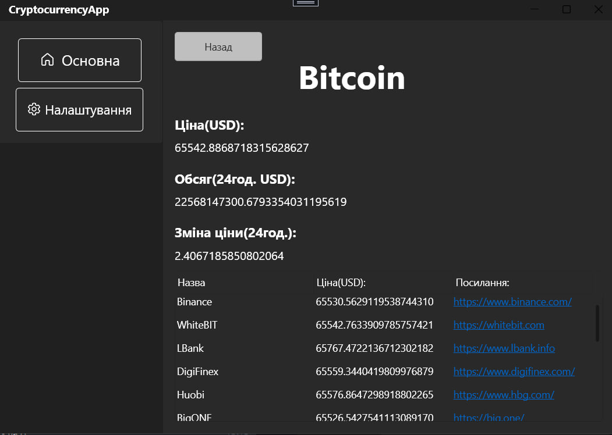
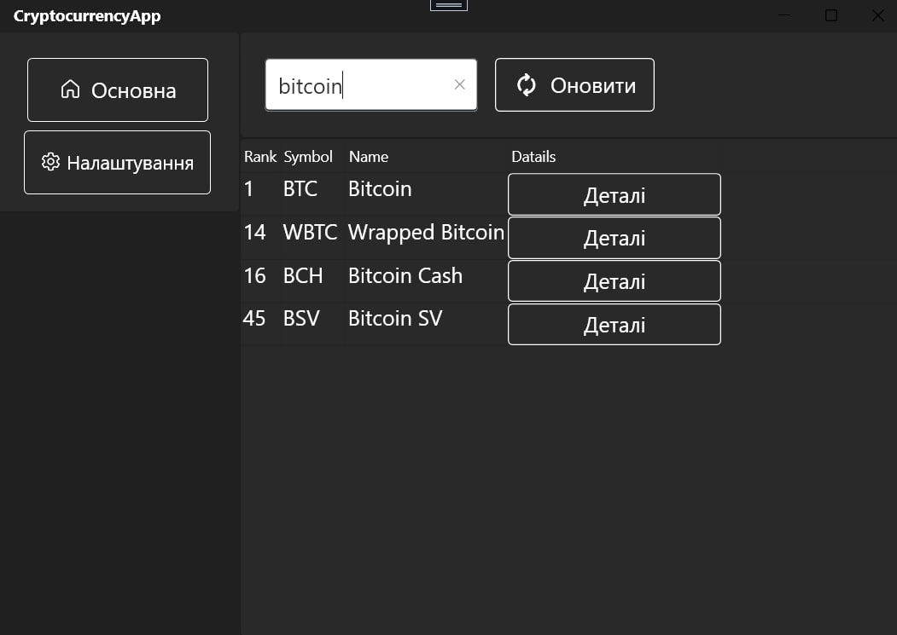
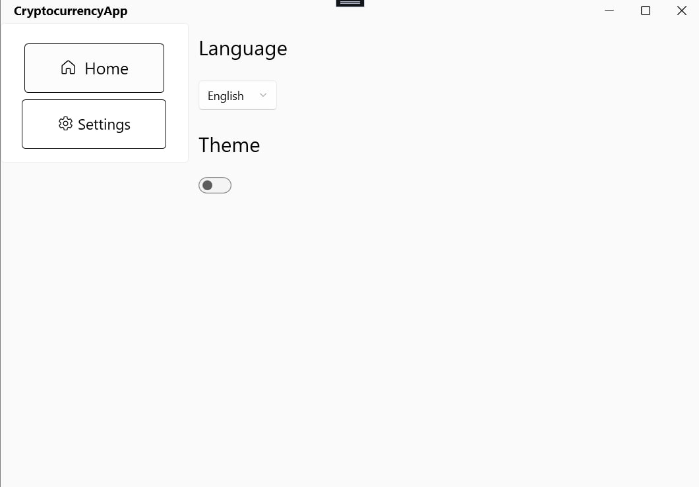
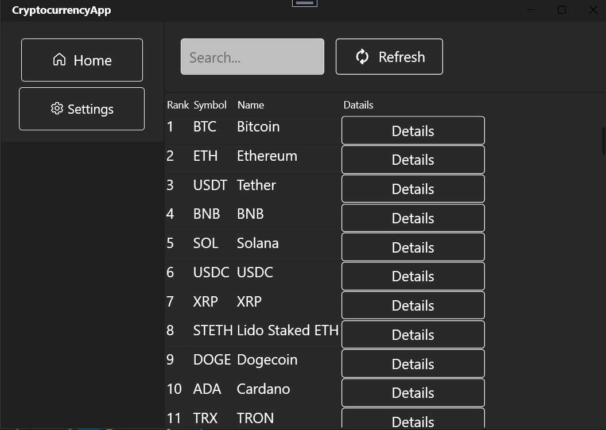

# CryptocurrencyApp

## Overview

This application provides various information related to cryptocurrencies, developed using **C#** and **.NET WPF** technologies. The application utilizes the **CoinCap API** to fetch real-time cryptocurrency data.

## Features

- Multi-page application with navigation.
- Displays the top cryptocurrencies by popularity.
- Detailed information about each currency:
  - Price
  - Volume (24hr)
  - Price Change (24hr)
  - Markets where the currency can be purchased
- Currency search functionality by name or code.
- Implemented using the **MVVM** design pattern.

## Additional Functionality

- Light/Dark theme support.
- Localizations for multiple languages.

## Technologies Used

- **C#**
- **.NET WPF**
- **WPF UI** for user interface design
- **Prism** 
- **[CoinCap API Documentation](https://docs.coincap.io/)** for cryptocurrency data retrieval

